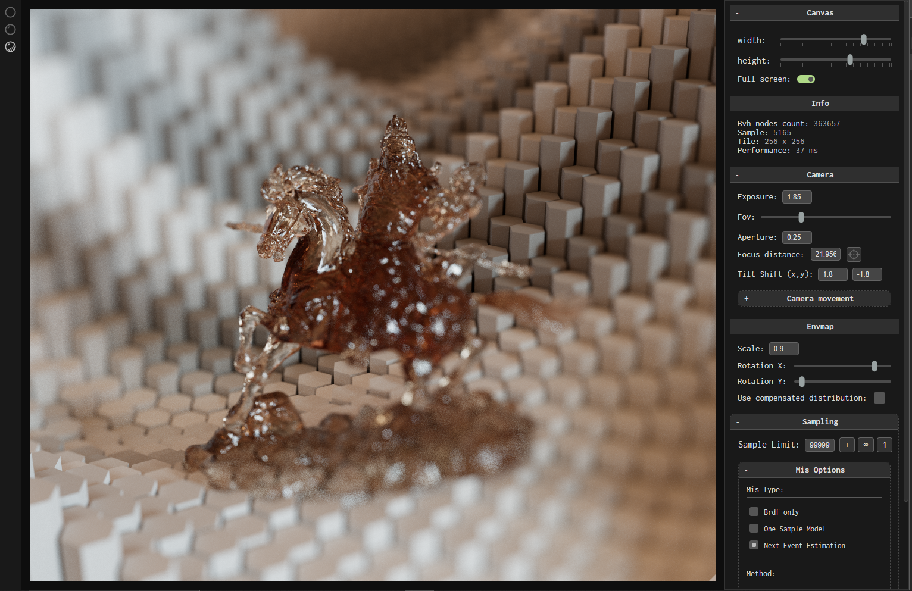

# C2-Renderer

A simple webgpu renderer implemented with javascript and svelte

[Web demo](https://domenicobrz.github.io/webgl/projects/c2-renderer/)

### Main features

1. Anisotropic Torrance-Sparrow BRDFs for conductors and dielectrics
2. Multi-scattering energy compensation LUTs for conductors and dielectrics
3. Beer-lambert volume absorption for dielectric materials
4. Simple Lambertian BRDF and Energy-preserving Oren Nayar diffuse BRDF model
5. Multiple importance sampling with either one-sample model (OSM) or next-event estimation (NEE)
6. Support for bump maps, albedo and roughness textures
7. Importance-sampled environment-maps with PiecewiseConstant2D constructs from pbrt v4, including switch between standard and compensated distributions
8. Camera model with support for tilt-shift and cat-eyed bokeh effects
9. Normal-view and camera-light previews
10. HDR envmap to PC2D conversion and export
11. Different types of samplers: Uniform, Halton, Blue noise and a customized "sequenced" version of the R2 sampler
12. 3 types of pixel-decorrelation strategies (none, random offset, blue noise mask)

###### C2 implements research from:

1. [EON: A practical energy-preserving rough diffuse BRDF](https://arxiv.org/pdf/2410.18026)
2. [Practical multiple scattering compensation for microfacet models](https://blog.selfshadow.com/publications/turquin/ms_comp_final.pdf)
3. [R2 Low discrepancy sequence](https://extremelearning.com.au/unreasonable-effectiveness-of-quasirandom-sequences/)
4. [Multiple importance sampling](https://graphics.stanford.edu/courses/cs348b-03/papers/veach-chapter9.pdf)
